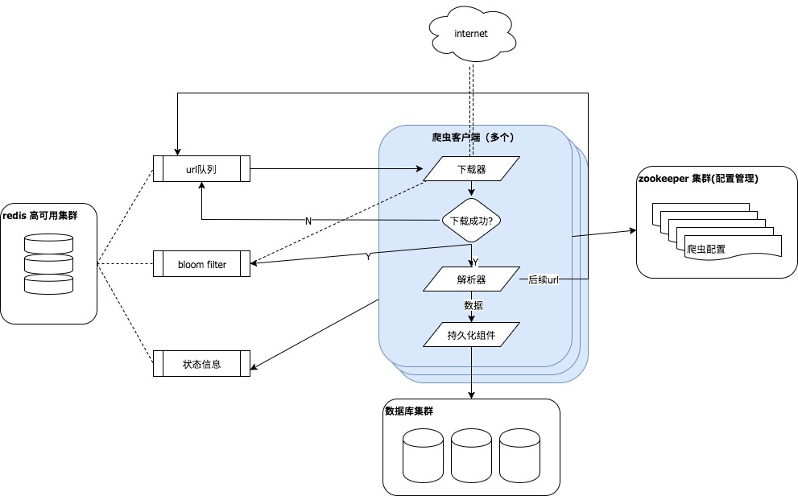
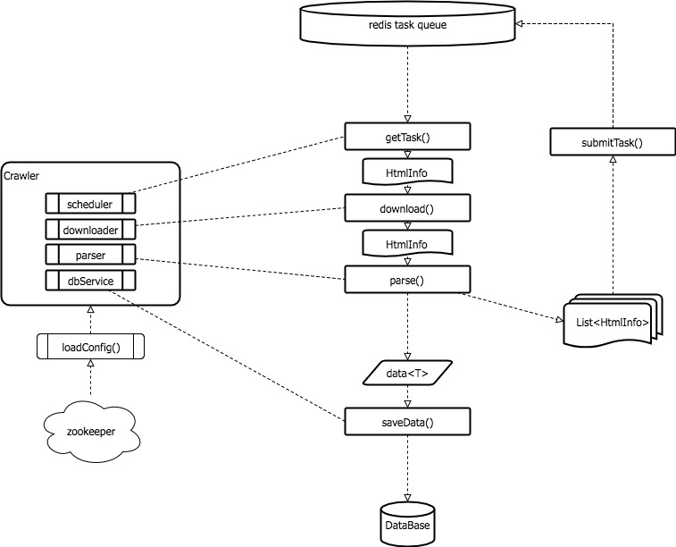

# readme

## 0 feture

- 分布式
- 断点爬取
- 多线程

## 1 部署·运行

1. 安装redis-cluster(3 * master+3 * slave)，配置见config.properties
2. 配置文件config.properties
	- 数据库连接信息
	- 布隆过滤器设置：可接受的误判率，预计实体总数
	- redis cluster信息
2. 运行common.Crawler.main
``` java
        Crawler crawler = new Crawler("TestNewsSearch", 1);//爬虫名，媒体类型
        crawler.start(1);//启动线程数
```


## 2 架构



- 任务队列：redis-cluster[√]
- url过滤：bloom filter redis[√]
- CrawlerClient[√]
    - executor 控制crawler的执行，线程池
    - scheduler 调度器，获取/提交任务
    - downloader 下载器
    - extractor 解析器
    - save 数据保存
- 持久层：mybatis[]
    - BaseService[√]
    - WeixinService[√]
    - ...
- ~~配置管理：zookeeper[]~~


## 3 配置
src/main/resource/ 运行配置
src/test/resource/ 测试配置

- config.properties 系统配置
- 不需要经常修改的配置

    - daoConf/: 存放mybatis mappers
    - typeConf/: 类型属性配置
    - xpathConf/: 站点xpath配置
    - app-sysconfig.xml: spring配置文件
    - crawlerlog.properties: 强哥的日志组件配置
    - img.dic&invalid.dic: 无视
    - simplelogger.properties: 日志配置

## 4 开发&&优化

#### 4.0 程序结构
- main/java
	- common
		- aop: 暂未使用，可用来拦截数据保存方法进行urlFilter.add()操作，或用作输出日志
		- downloader: 下载器
		- executor: 执行器，控制线程池
		- extractor: 解析器 
		- http: 保存了旧版的http，有些extractor中用到
		- mapper: mybatis java对象到数据库的映射接口
		- other: 测试aop，无用
		- pojos: 原bean包
		- redis: 任务队列及urlFilter实现
		- scheduler: 客户端与任务队列交互
		- service: 数据保存
		- siteinfo: 站点属性，包括xpath模板
		- system: 系统初始化，用户管理等
		- task: CrawlerType(其实是mediaType), SearchKey(关键词)
		- urlFilter: url去重
		- utils: 工具类
		- Crawler.java 启动类

- test/java: 单元测试

#### 4.1 downloader
已用OkHttp3重写

#### 4.2 executor 
沿用之前版本


#### 4.3 crawler相关


- 每种媒体类型对应一个任务队列，命名："TASK_QUEUE_${mediaType}"

    例如"TASK_QUEUE_1"代表新闻搜索的任务队列

- 任务CrawlerTask(原HtmlInfo)
    - 必要信息：
        - OrignUrl
        - mediaType: 媒体类型(新闻搜索、微博监控等)
        - site: 站点标识, e.g., "baidu_news_search"
        - crawlType: 采集类型(META/DATA，列表页/详情页)
        - searchKey: 记录关键词信息(categoryCode等)
        - data: meta数据(如果是META任务则不含此项)
        - encode: 目标页面编码

- 处理流程



``` 伪代码
while true:
  scheduler从redis获取一个任务
  downloader下载页面
  extractor对网页解析
  if 列表页:
  	解析结果list生成task进行提交
  	后续翻页url生成task提交
  if 详情页:
  	保存
  	加入urlFilter
```

#### 4.4 持久化(数据保存)

已用mybatis 重写，开发方式：

1. 新建 XxxMapper.java
2. 实现 XxxService.java
3. 新建 mapper-xxx.xml
4. 修改 app-sysconfig.xml，```xxxMapper和xxxService```两个bean
5. 测试

```
/*
mybatis注意事项

mybatis 插入数据，oracle通过序列生成自增主键，setId()给实体

sql的每个字段，实体对应的属性都必须有值，否则无法写入数据库
在service.saveData()中添加了数据检查，Override此方法以实现在保存数据前自定义检查数据完整性。
*/
```

#### 4.5 urlFilter(bloom filter) 初始化

- 只有该类别爬虫首次启动需要，会从数据库中读取对应表全部md5，遍历列表插入urlFilter，如数据库中已存在大量数据，耗时会比较长，如需优化参考TODO章节
- 必需等待类别urlFilter初始化完成(redis中BF_{mediaType}init_status变为2)，才能启动该类别的其他客户端，否则会提示urlFilter正在初始化并退出


## TODO

#### 初始化任务队列
从数据库读取关键词，生成task提交
建议启动单独的线程or进程，便于控制每轮扫描之间的间隔

#### 补全其他采集类型(参照news)
- downloader：微信(设置代理)、微博(需登录)等可修改/覆盖download()方法
	- 由于分布式爬虫客户端采取无状态方式，downloader只负责下载，因此旧版本download已经删除
- extractor: 沿用了全部旧版本的xpathextractor，一般不需要修改，如有问题，调试程序保证能够创建正确的extractor类即可
- 数据保存：参考4.4部分
如需切换到mysql数据库，只需要修改config.properties中数据库连接字段

#### 初始化bloomfilter耗时太长，修改方案：

- 初始化功能从爬虫客户端分离出来，独立进行
- 读数据库，获得游标，遍历的同时add进bloomfilter，不要select 装配到list之后再遍历
- 可以配合sql语句，启用多个线程初始化bf，提升效率

